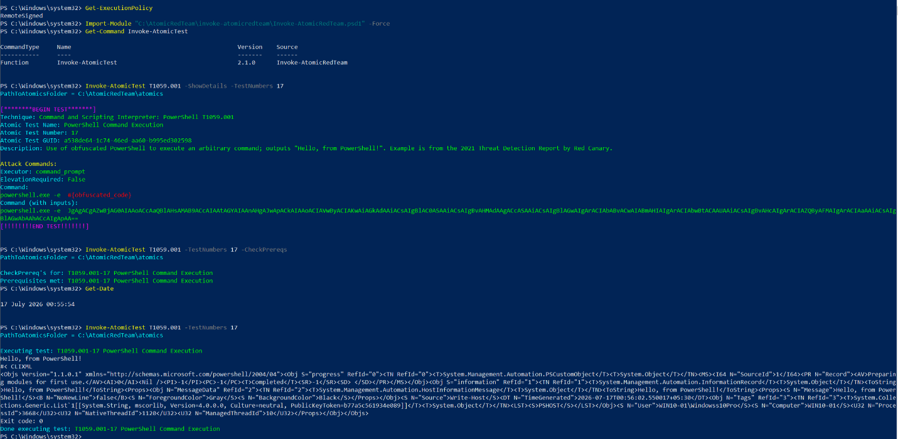

# Atomic Test Execution -- T1059.001-17

## Step 1 -- Review the Atomic Test

Before executing any Atomic test, understand exactly what it will do.

On **WIN10-01**, open an elevated PowerShell session and run:

```powershell
Invoke-AtomicTest T1059.001 -ShowDetails -TestNumbers 17
```

Confirm the following before proceeding:

- Test Name
- Description
- Executor
- Supported Platforms
- Command to be executed
- Input Arguments
- Dependencies
- Cleanup Commands

Do **not** execute the test yet -- read and understand it first.

## Step 2 -- Verify Prerequisites

Check whether the test requires any dependencies.

```powershell
Invoke-AtomicTest T1059.001 `
  -TestNumbers 17 `
  -CheckPrereqs
```

- If all prerequisites are satisfied, continue.
- If any prerequisite is missing, install it:

```powershell
Invoke-AtomicTest T1059.001 `
  -TestNumbers 17 `
  -GetPrereqs
```

Then run `-CheckPrereqs` again to confirm everything is ready.

> Even when a test is known to have no prerequisites, running `-CheckPrereqs` is part of a
> repeatable and auditable workflow. It keeps the process consistent and reproducible across
> every technique in this lab.

## Step 3 -- Record the Start Time

This is extremely useful later when correlating telemetry.

```powershell
Get-Date
```

Example: `14 July 2026 03:15:22`

Record the timestamp before execution.

## Step 4 -- Execute

```powershell
Invoke-AtomicTest T1059.001 -TestNumbers 17
```

**Execution record:**

| Field | Value |
|---|---|
| Command | `Invoke-AtomicTest T1059.001` |
| Start time | 00:55:54 on 17 July 2026 |
| Host | WIN10-01 |

Windows generated multiple security events related to PowerShell execution within seconds of
execution. These events were collected from Event Viewer and later verified in Splunk -- see
[`telemetry-validation.md`](03-telemetry-validation.md) and [`splunk-validation.md`](04-splunk-validation.md).


