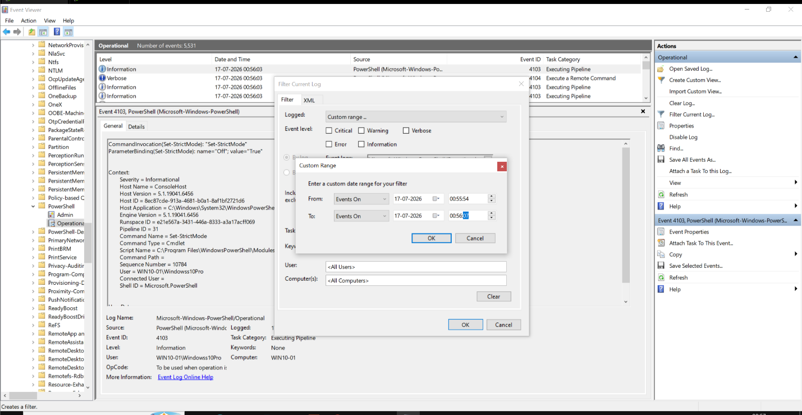
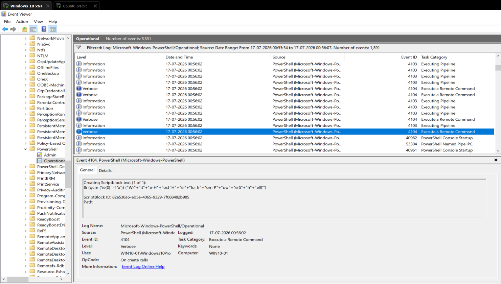
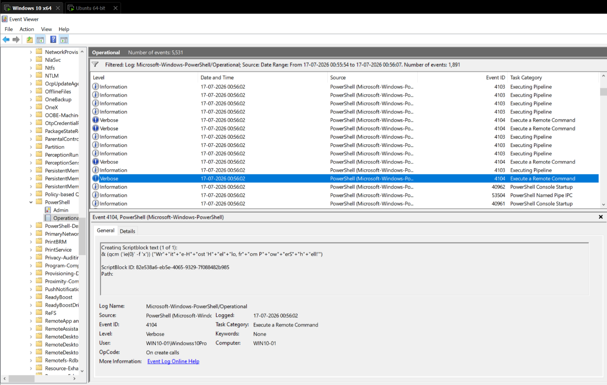
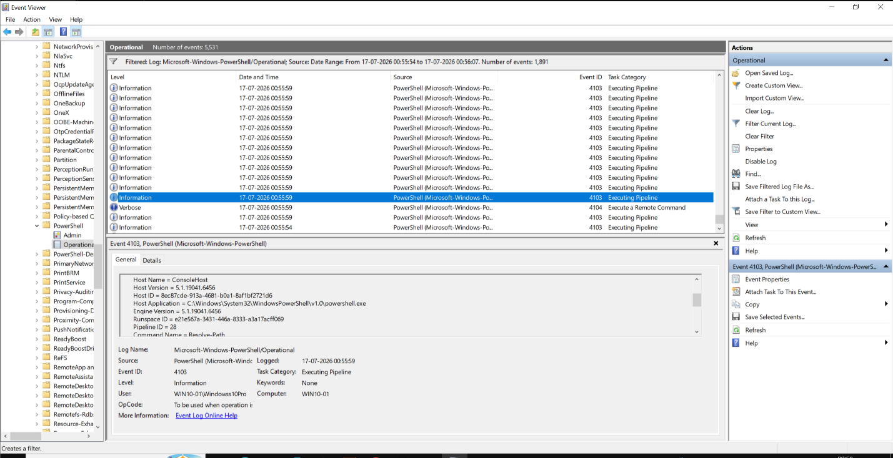
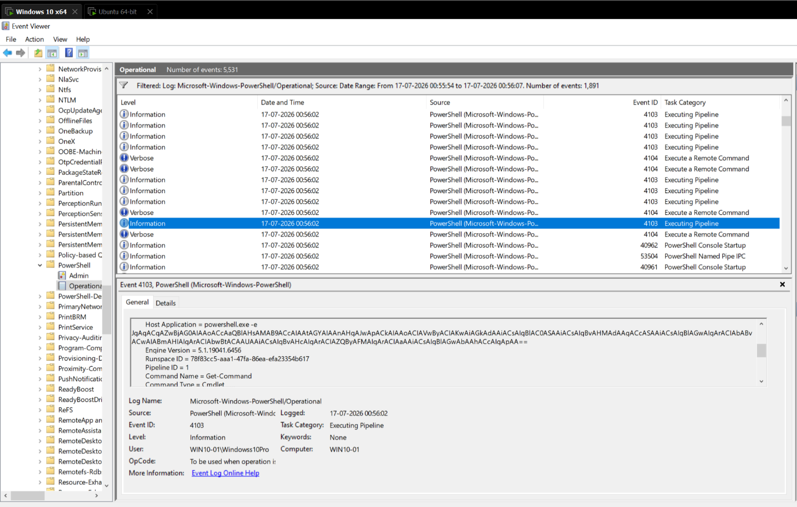
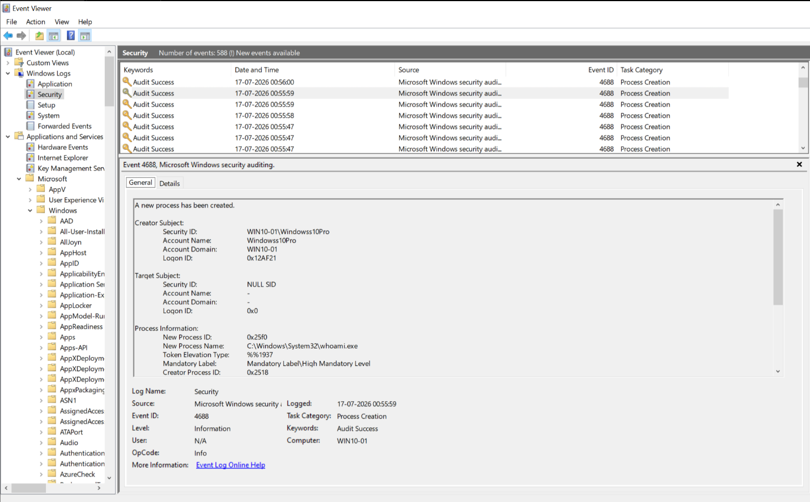
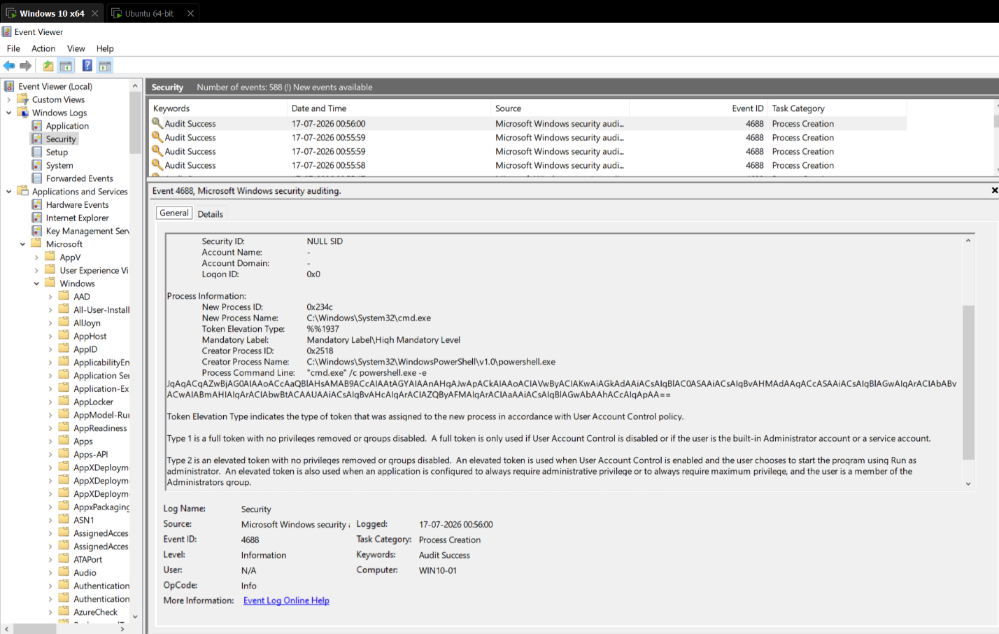
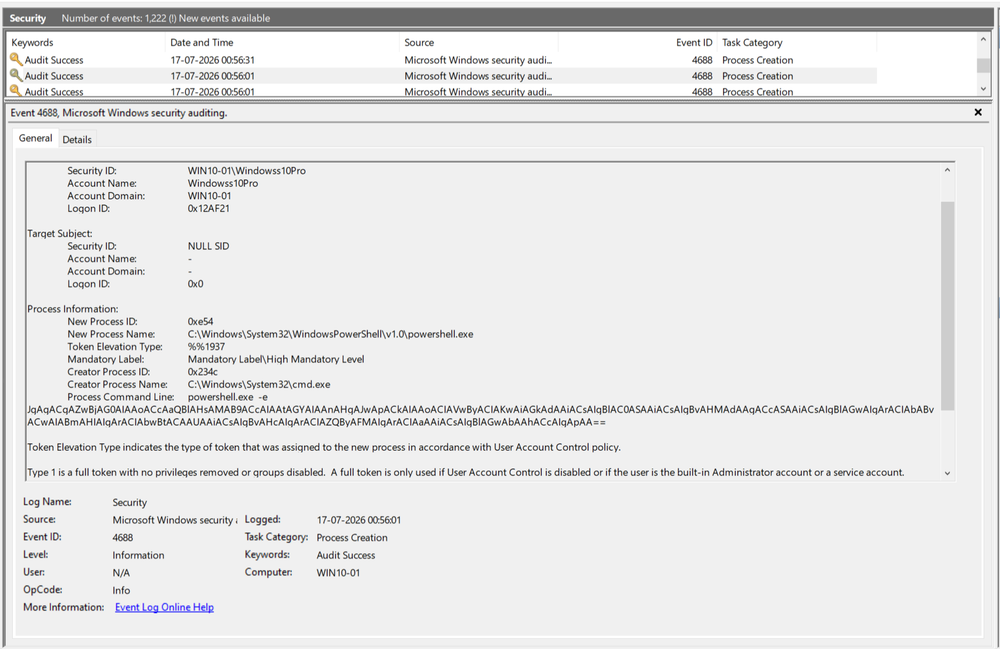

# Telemetry Validation -- T1059.001

To validate PowerShell logging and process creation telemetry, Atomic Red Team test
**T1059.001 -- PowerShell** was executed:

```powershell
Invoke-AtomicTest T1059.001
```

Execution began at approximately **00:55:54 on 17 July 2026**. Within the next few seconds,
Windows generated multiple security events related to PowerShell execution. These events were
collected from Event Viewer and later verified in Splunk (see [`splunk-validation.md`](04-splunk-validation.md)).


---

## 1. PowerShell Script Block Logging (Event ID 4104)

**Navigation:**
`Event Viewer → Applications and Services Logs → Microsoft → Windows → PowerShell → Operational`

Since the Operational log contains a large volume of PowerShell events, **Filter Current Log**
was used to narrow the investigation to the execution window around **00:55:54**. This
significantly reduced unrelated events and allowed the Atomic Test activity to be located
quickly.



Event ID **4104** records the actual PowerShell code executed by the PowerShell engine. Unlike
process creation events, Script Block Logging captures script contents *after* PowerShell has
interpreted them, making it one of the most valuable telemetry sources for detecting
PowerShell-based attacks.

The recovered script block clearly corresponds to the commands executed by the Atomic Red Team
test.

**Raw Event (General View):**




Key fields recovered from the XML view:

| Field | Value |
|---|---|
| EventID | 4104 |
| TimeCreated | 2026-07-16T19:25:59.9117610Z |
| Computer | WIN10-01 |
| ScriptBlockText | `Invoke-AtomicTest T1059.001 -TestNumbers 17` |

---

## 2. PowerShell Module Logging (Event ID 4103)

Using the same filtered time window, the corresponding **4103** event was identified
immediately after the Script Block Logging event.

Unlike Event ID 4104, which records the executed script content, Event ID **4103** records
pipeline execution details and module-level activity, including the host application
responsible for launching PowerShell. This provides additional context during investigations
and assists analysts in reconstructing attacker behavior.

**Raw Event (General View):**




Key fields recovered from the XML view:

| Field | Value |
|---|---|
| EventID | 4103 |
| Host Application | `C:\Windows\System32\WindowsPowerShell\v1.0\powershell.exe` |
| Command Name | Resolve-Path |
| User | WIN10-01\Windowss10Pro |

---

## 3. Process Creation (Windows Security Event ID 4688)

**Navigation:** `Event Viewer → Windows Logs → Security`

The Security log was filtered to the same execution window (approximately **00:55:54--00:56:02**)
to identify the PowerShell process responsible for executing the Atomic Test.

Event ID **4688 -- A New Process Has Been Created** records every new process created by Windows
and provides valuable forensic information: Subject User, Parent Process, Newly Created
Process, and Full Command Line.

In this case, the event shows that **cmd.exe** spawned **powershell.exe**, which executed an
**EncodedCommand (`-e`)**. This command-line pattern is commonly observed in offensive
PowerShell frameworks and is therefore an important detection point.

**Raw Event (General View):**





Key fields recovered from the XML view:

| Field | Value |
|---|---|
| EventID | 4688 |
| SubjectUserName | Windowss10Pro |
| ParentProcessName | `C:\Windows\System32\cmd.exe` |
| NewProcessName | `C:\Windows\System32\WindowsPowerShell\v1.0\powershell.exe` |
| CommandLine | `powershell.exe -e <Base64 Encoded Command>` |

## Conclusion

All three expected log sources -- PowerShell Operational (4104, 4103) and Windows Security
(4688) -- successfully captured the Atomic Red Team execution. This confirms Detection
Objective #1 (*"Did Windows generate the expected telemetry?"*) from [`hypothesis.md`](01-hypothesis.md).

Next: [`splunk-validation.md`](04-splunk-validation.md) confirms ingestion into Splunk.
