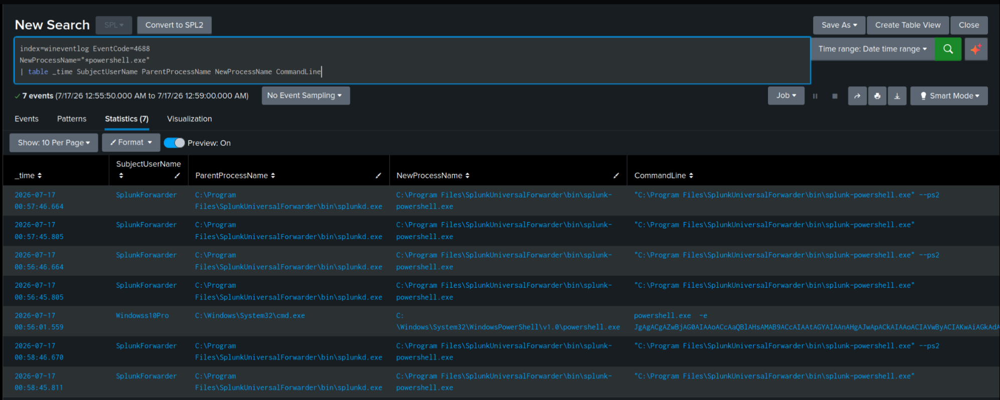
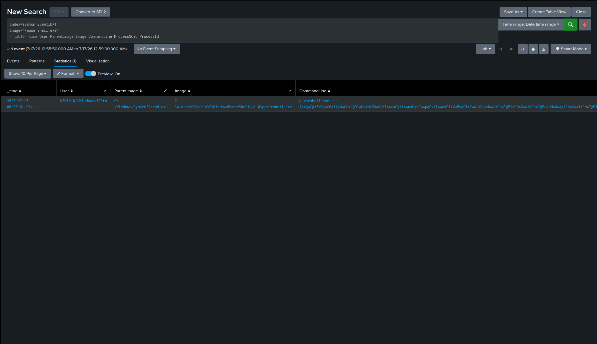
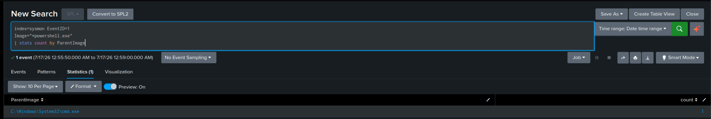
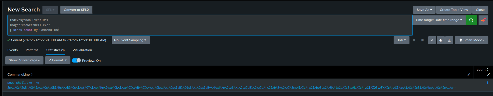
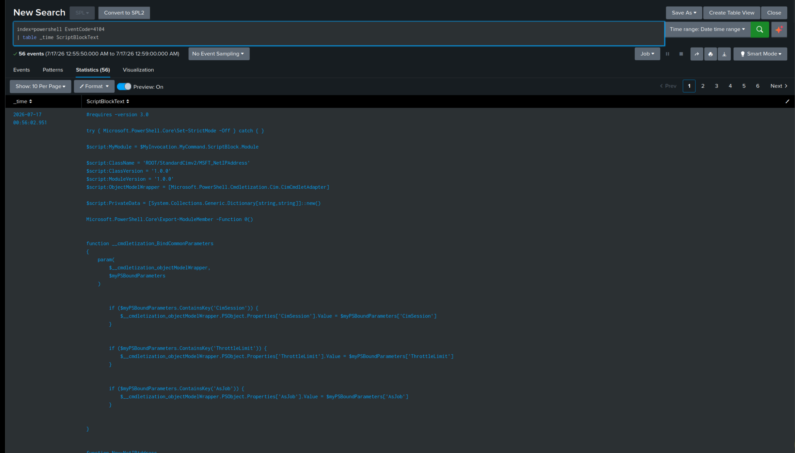
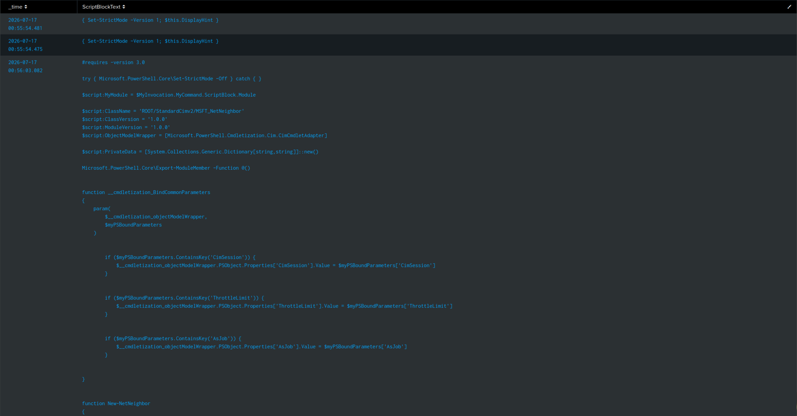
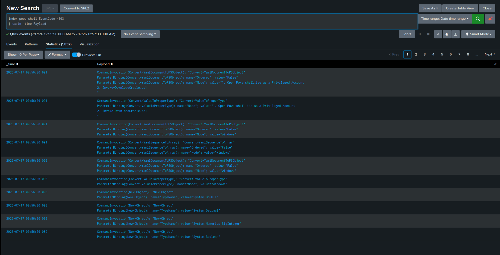

# Splunk Validation -- T1059.001

After confirming the events in Event Viewer, the same activity was validated in Splunk to
ensure the telemetry was successfully ingested through the Splunk Universal Forwarder. The
investigation focused on the execution window between **00:55:54 and 00:56:02**.

## Query 1 -- Verify Process Creation (Windows Security Log)

**Purpose:** verify whether Windows Security Event ID 4688 recorded the PowerShell process
launched by the Atomic Test.

```spl
index=wineventlog EventCode=4688
NewProcessName="*powershell.exe"
| table _time SubjectUserName ParentProcessName NewProcessName CommandLine
```



| Field | Value | Significance |
|---|---|---|
| Timestamp | 2026-07-17 00:56:01.559 | Time the PowerShell process was created |
| Subject User | Windowss10Pro | User account under which the process executed |
| Parent Process | `C:\Windows\System32\cmd.exe` | Command Prompt launched PowerShell |
| New Process | `C:\Windows\System32\WindowsPowerShell\v1.0\powershell.exe` | Process recorded by Event ID 4688 |
| Command Line | `powershell.exe -e <Base64 Encoded Command>` | PowerShell executed via `-e` (EncodedCommand), a commonly observed obfuscation technique |

**Observation:** The Event ID 4688 log confirms `cmd.exe` spawned `powershell.exe` at
`00:56:01.559` under the `Windowss10Pro` account, using the `-e` (EncodedCommand) parameter --
a behavior frequently observed in attack frameworks and malware to obfuscate PowerShell
commands.

---

## Query 2 -- Verify Sysmon Process Creation

**Purpose:** Sysmon provides richer telemetry than Windows Security logs. This query verifies
the same PowerShell execution using Sysmon Event ID 1.

```spl
index=sysmon EventID=1
Image="*powershell.exe"
| table _time User ParentImage Image CommandLine ProcessGuid ProcessId
```



| Field | Value |
|---|---|
| Timestamp | 2026-07-17 00:56:01.974 |
| User | WIN10-01\Windowss10Pro |
| Parent Image | `C:\Windows\System32\cmd.exe` |
| Image | `C:\Windows\System32\WindowsPowerShell\v1.0\powershell.exe` |
| Command Line | `powershell.exe -e <Base64 Encoded Command>` |
| Process GUID | `{8afbfb42-3049-6a59-7501-000000003100}` |
| Process ID | 3668 |

**Observation:** Sysmon Event ID 1 confirms PowerShell was launched at `00:56:01.974` from
`cmd.exe`, using the `-e` parameter. Sysmon's Process GUID and Process ID allow correlation
with other Sysmon events during further investigation.

---

## Query 3 -- Verify Parent Process

**Purpose:** identify which process launched PowerShell.

```spl
index=sysmon EventID=1
Image="*powershell.exe"
| stats count by ParentImage
```



**Observation:** `cmd.exe` was the parent process responsible for launching PowerShell during
the Atomic Test.

---

## Query 4 -- Verify Executed Command Line

**Purpose:** display the exact PowerShell command executed.

```spl
index=sysmon EventID=1
Image="*powershell.exe"
| stats count by CommandLine
```



**Observation:** The PowerShell process was executed using the `-e` (EncodedCommand) parameter.
Encoded PowerShell commands are frequently used by attackers to conceal malicious scripts,
making this an important detection indicator.

---

## Query 5 -- Verify PowerShell Script Block Logging

**Purpose:** verify that PowerShell Script Block Logging captured the executed commands.

```spl
index=powershell EventCode=4104
| table _time ScriptBlockText
```




**Observation:** Event ID 4104 successfully captured the PowerShell script blocks executed by
the Atomic Test. Script Block Logging provides high-fidelity visibility into PowerShell
activity because it records the actual PowerShell code executed.

---

## Query 6 -- Verify Module Logging

**Purpose:** verify PowerShell Module Logging.

```spl
index=powershell EventCode=4103
| table _time Payload
```



**Observation:** Event ID 4103 successfully captured module-level pipeline execution details,
corroborating the Script Block Logging evidence from Query 5.

## Conclusion

All expected indexes (`wineventlog`, `sysmon`, `powershell`) correctly ingested the telemetry
generated by the Atomic Test. This confirms Detection Objectives #2 and #3 from
[`hypothesis.md`](01-hypothesis.md).

Next: [`evidence.md`](05-evidence.md) covers Sigma rule development and the Sigma → SPL conversion.
