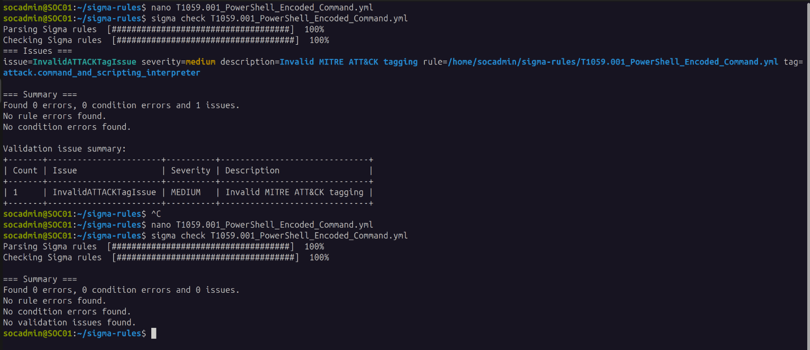
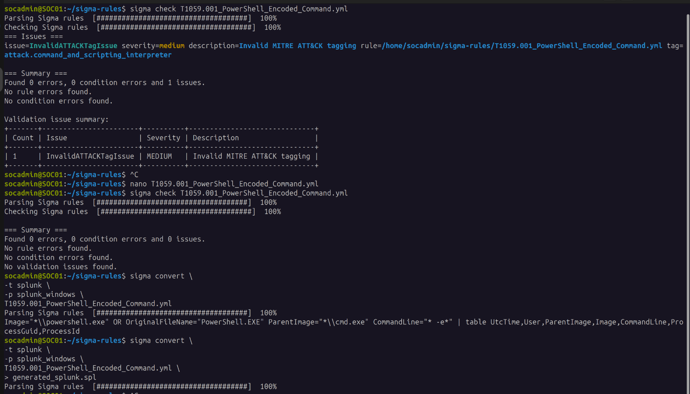
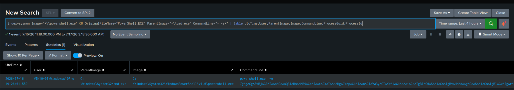

# Detection Evidence -- Sigma Rule Development & SPL Conversion (T1059.001)

## 4.1 Objective

Develop a Sigma rule to detect PowerShell execution via **Command Prompt (cmd.exe)** using an
**EncodedCommand** parameter. The rule is based on telemetry collected during the Atomic Red
Team simulation and validated through Windows Event Logs and Splunk.

## 4.2 Evidence Used

| Evidence Source | Purpose |
|---|---|
| PowerShell Operational (Event ID 4104) | Verified PowerShell script block execution |
| PowerShell Operational (Event ID 4103) | Confirmed PowerShell module logging |
| Security Event ID 4688 | Validated process creation and command-line arguments |
| Sysmon Event ID 1 | Captured detailed process creation telemetry including parent process and command line |
| Splunk Correlation | Verified consistent detection artifacts across log sources |

## 4.3 Detection Artifacts

| Field | Observed Value |
|---|---|
| Event ID | 1 (Sysmon) |
| Image | `powershell.exe` |
| ParentImage | `cmd.exe` |
| CommandLine | `-e`, `-enc`, or `-EncodedCommand` |

## 4.4 Detection Logic

The Sigma rule generates an alert when all of the following conditions are met:

- **A PowerShell process is created** -- matched on `Image` ending in `\powershell.exe`, or the
  binary's `OriginalFileName` metadata reading `PowerShell.EXE`. Checking both instead of just
  the filename means the detection still fires even if an attacker renames the executable to
  evade a simple filename match -- `OriginalFileName` is read from the binary's internal
  metadata, not from what it's called on disk.
- **The parent process is Command Prompt (`cmd.exe`).**
- **The command line contains an encoded PowerShell execution flag.** Rather than matching an
  exact list (`-e`, `-enc`, `-EncodedCommand`), the rule matches the substring `' -e'` as it
  would actually appear on the command line (with its leading space). PowerShell's argument
  parser accepts any unambiguous prefix of a parameter name, so `-e`, `-en`, `-enc`, `-enco`,
  all the way up to `-encodedcommand`, are functionally identical and valid. An exact-string
  list would miss variants like `-enco` that a real attacker (or off-the-shelf offensive tool)
  might use -- matching the shared substring closes that gap in one line instead of trying to
  enumerate every valid abbreviation.

This combination -- an obfuscated PowerShell invocation spawned specifically from a command
shell -- is a stronger combined signal than either condition alone, which is why the rule is
scored **high** rather than **medium**: both conditions have to be true simultaneously, not
just one.

This logic maps to **MITRE ATT&CK T1059.001** (Command and Scripting Interpreter: PowerShell),
and reflects encoded-command execution techniques commonly used to obfuscate malicious
PowerShell activity from casual log review.

## 4.5 Sigma Rule

See [`sigma/T1059.001_PowerShell_Encoded_Command.yml`](sigma/T1059.001_PowerShell_Encoded_Command.yml)
for the full rule.

## 4.6 Sigma Rule Conversion

After developing and validating the Sigma rule, it was converted into Splunk Search Processing
Language (SPL) using the official **Sigma CLI** and the **Splunk Windows** processing pipeline.
This demonstrates how a platform-independent Sigma rule can be translated into a SIEM-specific
detection.

### 4.6.1--4.6.3 Environment Setup

Sigma CLI, the Splunk backend plugin, and the `splunk_windows` pipeline were installed and
verified on SOC01 as a one-time environment setup, not repeated per technique. See
[`docs/07-sigma-cli-setup.md`](../../docs/07-sigma-cli-setup.md) for the full installation
steps, verification commands, PATH troubleshooting, and setup evidence screenshots.

### 4.6.4 Validate the Sigma Rule

```bash
sigma check T1059.001_PowerShell_Encoded_Command.yml
```



Output:
```
Found 0 errors
Found 0 condition errors
No validation issues found.
```

This confirms the Sigma rule follows the official Sigma specification.

### 4.6.5 Convert Sigma Rule to SPL

```bash
sigma convert \
  -t splunk \
  -p splunk_windows \
  T1059.001_PowerShell_Encoded_Command.yml

# save for future reference
sigma convert \
  -t splunk \
  -p splunk_windows \
  T1059.001_PowerShell_Encoded_Command.yml \
  > generated_splunk.spl
```



### 4.6.6 Generated SPL (Official Output)

The following query was generated directly by the official Sigma CLI without any manual
modifications -- see [`spl/generated_splunk.spl`](spl/generated_splunk.spl):

```spl
Image="*\\powershell.exe" OR OriginalFileName="PowerShell.EXE" ParentImage="*\\cmd.exe" CommandLine="* -e*" | table UtcTime,User,ParentImage,Image,CommandLine,ProcessGuid,ProcessId
```

Although functionally correct, the generated query does not include environment-specific
information such as Splunk index names, because Sigma rules are designed to remain
platform-independent.

### 4.6.7 Environment-Specific SPL (Tuned Query)

The generated SPL was modified to match the lab environment by specifying the Sysmon index and
improving query readability through explicit logical grouping -- see
[`spl/tuned_splunk.spl`](spl/tuned_splunk.spl):

```spl
index=sysmon
(Image="*\\powershell.exe" OR OriginalFileName="PowerShell.EXE")
AND ParentImage="*\\cmd.exe"
AND CommandLine="* -e*"
| table UtcTime User ParentImage Image CommandLine ProcessGuid ProcessId
```

| Modification | Reason |
|---|---|
| Added `index=sysmon` | Restricts the search to Sysmon events stored in the lab environment |
| Added parentheses around the PowerShell conditions | Makes logical precedence explicit and improves readability |
| Formatted the query across multiple lines | Improves maintainability and simplifies future modifications |

### 4.6.8 Detection Verification

The tuned SPL query was executed against the `sysmon` index within Splunk Enterprise and
successfully detected the PowerShell execution generated during the Atomic Red Team simulation.

| Field | Observed Value |
|---|---|
| User | WIN10-01\Windowss10Pro |
| ParentImage | `C:\Windows\System32\cmd.exe` |
| Image | `C:\Windows\System32\WindowsPowerShell\v1.0\powershell.exe` |
| CommandLine | `powershell.exe -e <Base64 Encoded Command>` |
| ProcessId | 3668 |



**Figure:** Detection result of the tuned SPL query executed against the Sysmon index.

### 4.6.9 Observation

The Sigma rule was successfully converted into Splunk SPL using the official Sigma CLI. The
generated query required only minor environment-specific modifications -- primarily the
addition of the `sysmon` index and formatting improvements for readability. After tuning, the
query successfully detected the encoded PowerShell execution produced during the Atomic Red
Team simulation, confirming that the Sigma detection logic remained effective within the
configured Splunk environment.

This satisfies Detection Objective #4 from [`hypothesis.md`](01-hypothesis.md). Status: **Validated
-- Tuned**. Tracked in [`coverage/attack-matrix.md`](../../coverage/attack-matrix.md).
