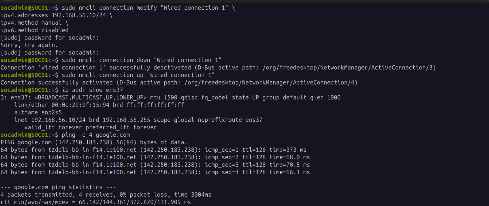
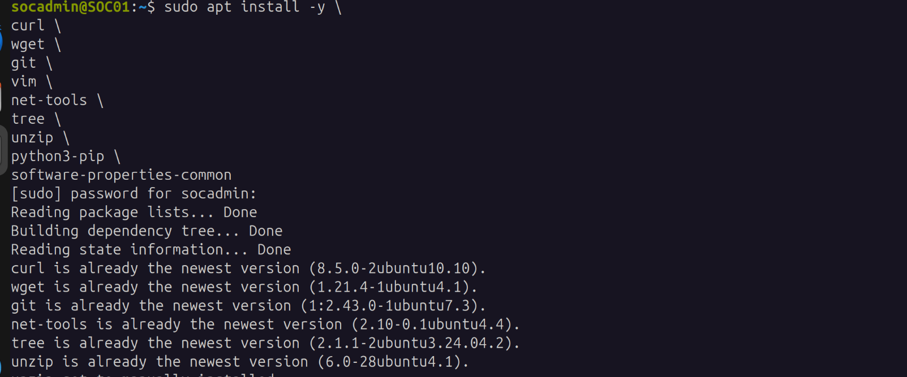
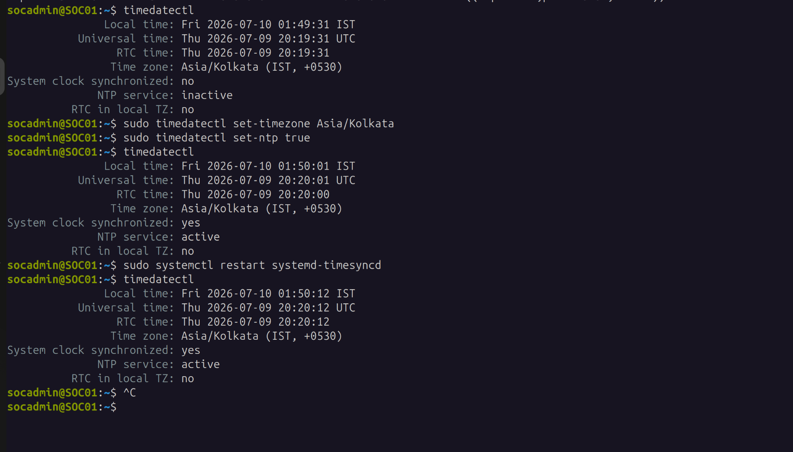

# Ubuntu SOC Server Setup

**Status:** Complete
**Lab:** Splunk Detection Engineering Lab
**Updated:** 2026-07-16

SOC01 is the Ubuntu box that runs Splunk Enterprise and receives telemetry from the Windows endpoint. This doc covers OS prep and networking for SOC01 only — Splunk itself is in `03-splunk-installation.md`, and Windows endpoint setup (WIN10-01) is in `04-windows-setup.md` and `05-windows-telemetry.md`.

## VM specs

| Component | Value |
|---|---|
| Hypervisor | VMware Workstation Pro |
| OS | Ubuntu Desktop 24.04.4 LTS |
| vCPU | 4 |
| RAM | 8 GB |
| Disk | 90 GB (SCSI) |
| Hostname | SOC01 |
| User | socadmin |

## Hostname

Default hostname was `UbuntuDesktop`, changed to a production-style name so it stays meaningful in Splunk logs, terminal prompts, and later cross-referencing with the Windows endpoint.

```bash
sudo hostnamectl set-hostname SOC01
```

`/etc/hosts` updated to match:
```
127.0.1.1 SOC01
```

## Admin account

Created a dedicated `socadmin` account instead of running everything off the default desktop user, and added it to `sudo`. Keeps the box's admin trail separate from whatever the base image shipped with.

```bash
groups socadmin
# socadmin sudo
```

## Network

Two adapters — NAT for internet (updates, downloads), host-only for the isolated lab segment where SOC01 talks to the Windows endpoint.

| Adapter | Role | Config |
|---|---|---|
| ens33 | Internet | NAT / DHCP |
| ens37 | Lab network | Host-only, static |

Static IP was set with `nmcli` instead of editing netplan directly. Chosen so Universal Forwarder config, Splunk inputs, and later Active Directory integration don't break if a DHCP lease changes.

```bash
sudo nmcli connection modify "Wired connection 1" \
  ipv4.addresses 192.168.56.10/24 \
  ipv4.method manual \
  ipv6.method disabled

sudo nmcli connection down "Wired connection 1"
sudo nmcli connection up "Wired connection 1"
```

Verified:

```bash
ip addr show ens37
# inet 192.168.56.10/24 ... scope global noprefixroute ens37

ping -c 4 google.com
# 0% packet loss — NAT path still working after the static IP change
```



## Base administration tools

```bash
sudo apt install -y curl wget git vim net-tools tree unzip python3-pip software-properties-common
```

Most of these were already on the image from a prior `apt` run — only `software-properties-common` actually got installed fresh.



## Time synchronization

Checked the clock status before changing anything:

```bash
timedatectl
# System clock synchronized: no
# NTP service: inactive
```

Set the correct timezone and turned NTP on:

```bash
sudo timedatectl set-timezone Asia/Kolkata
sudo timedatectl set-ntp true
```

`timedatectl` immediately after confirmed it took:

```bash
# System clock synchronized: yes
# NTP service: active
```

Restarted `systemd-timesyncd` and checked once more, to make sure the sync survives a service restart and isn't just a one-off right after enabling it:

```bash
sudo systemctl restart systemd-timesyncd
timedatectl
# System clock synchronized: yes
# NTP service: active
```



Correct time matters here specifically because Splunk timestamps everything it indexes — if SOC01's clock is off, correlating Windows telemetry against Splunk's own index time becomes unreliable.

## Where this leaves things

SOC01 has a stable hostname, a static IP on the lab segment that won't shift under Splunk's configuration, correct time sync, and the base tooling needed for the next phase. Splunk installation is covered in `03-splunk-installation.md`.
